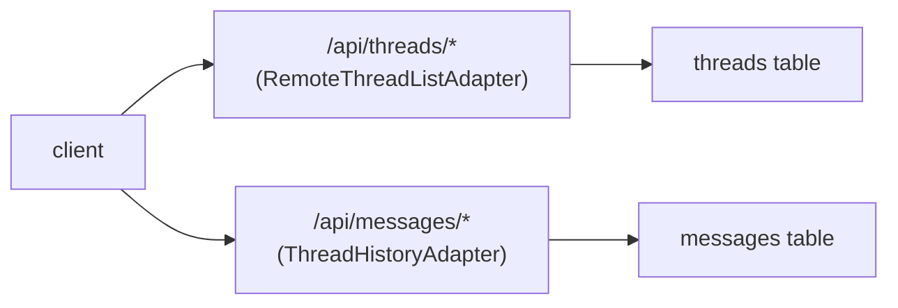

When [AssistantCloud](/docs/cloud) doesn't fit (self-hosting, compliance, threads alongside existing app data), back the multi-thread runtime with your own database. This page is the worked example: schema, route handlers, and adapter wiring with Postgres + Drizzle. The shape is identical for any SQL or document store.

For the high-level adapter contract, see [threads](/docs/runtimes/concepts/threads). This page focuses on the storage layer and how `withFormat` round-trips AI SDK messages.

## Prerequisites

The route handlers below import `auth` from `@/auth` and `db` from `@/db`. This guide assumes:

- A working [Drizzle setup](https://orm.drizzle.team/docs/get-started-postgresql) at `db/index.ts` exporting a `db` instance.
- An auth solution with a server-side `auth()` helper exposing `session.user.id`. See [Auth.js (next-auth)](/docs/integrations/auth/next-auth) for the canonical setup, including the callback that populates `session.user.id`.

If you're rolling your own auth, replace `auth()` calls with whatever your stack uses to resolve the current user.

## How it works



Two adapters, two tables:

- **`RemoteThreadListAdapter`** owns thread *metadata*: list, create, rename, archive, delete.
- **`ThreadHistoryAdapter`** owns *messages* per thread. The `withFormat` variant is required by `useChatRuntime` and converts AI SDK `UIMessage` to and from a fixed row shape: `{ id, parent_id, format, content }`.

## Schema

```ts title="db/schema.ts"
import { pgTable, text, timestamp, jsonb, index } from "drizzle-orm/pg-core";

export const threads = pgTable(
  "threads",
  {
    id: text("id").primaryKey(),
    userId: text("user_id").notNull(),
    title: text("title"),
    status: text("status", { enum: ["regular", "archived"] })
      .notNull()
      .default("regular"),
    custom: jsonb("custom").$type<Record<string, unknown>>(),
    createdAt: timestamp("created_at").notNull().defaultNow(),
    updatedAt: timestamp("updated_at").notNull().defaultNow(),
  },
  (t) => [index("threads_user_idx").on(t.userId)],
);

export const messages = pgTable(
  "messages",
  {
    id: text("id").primaryKey(),
    threadId: text("thread_id")
      .notNull()
      .references(() => threads.id, { onDelete: "cascade" }),
    parentId: text("parent_id"),
    format: text("format").notNull(),
    content: jsonb("content").notNull(),
    createdAt: timestamp("created_at").notNull().defaultNow(),
  },
  (t) => [index("messages_thread_idx").on(t.threadId)],
);
```

The four message columns (`id`, `parent_id`, `format`, `content`) are the contract `withFormat` writes against. `format` records which adapter encoded the row so multiple runtimes can coexist on one table; `useChatRuntime` sets it from `fmt.format`.

<Callout type="warn">
  `content` is not arbitrary JSON. It must be the payload the active format adapter produced via `fmt.encode(item)`, and it is read back through `fmt.decode`; the route handlers below are a pass-through that never inspects it. For `useChatRuntime` (AI SDK v6) a valid stored row looks like:

  ```json
  {
    "id": "msg_abc",
    "parent_id": null,
    "format": "ai-sdk/v6",
    "content": { "role": "user", "parts": [{ "type": "text", "text": "hello" }] }
  }
  ```

  A row that satisfies the column types but carries a different shape (e.g. `{ "foo": "bar" }`) is accepted on write, then fails history reload. Seed test data through the adapter, not by hand-crafting `content`.
</Callout>

## Setup

<Steps>
<Step>

### Install dependencies

<InstallCommand npm={["drizzle-orm", "postgres", "drizzle-kit"]} />

Configure Drizzle and run the migration. See the [Drizzle quickstart](https://orm.drizzle.team/docs/get-started-postgresql) for the full setup.

</Step>
<Step>

### Build the thread list endpoints

Each method on `RemoteThreadListAdapter` maps to one route. Always scope by `userId` from the session so users see only their own threads.

```ts title="app/api/threads/route.ts"
import { db } from "@/db";
import { threads } from "@/db/schema";
import { auth } from "@/auth";
import { and, desc, eq } from "drizzle-orm";
import { generateId } from "ai";

export async function GET() {
  const session = await auth();
  if (!session?.user) return new Response(null, { status: 401 });

  const rows = await db
    .select()
    .from(threads)
    .where(eq(threads.userId, session.user.id))
    .orderBy(desc(threads.updatedAt));

  return Response.json(rows);
}

export async function POST(req: Request) {
  const session = await auth();
  if (!session?.user) return new Response(null, { status: 401 });

  const id = generateId();
  await db.insert(threads).values({ id, userId: session.user.id });
  return Response.json({ id });
}
```

Implement the per-thread routes the same way under `app/api/threads/[id]/route.ts`. `PATCH` updates `title` or `status` (used by `rename`, `archive`, `unarchive`); `DELETE` deletes the thread; `GET` returns one thread (used by `fetch`). Always check `userId` on every handler:

```ts title="app/api/threads/[id]/route.ts"
import { db } from "@/db";
import { threads } from "@/db/schema";
import { auth } from "@/auth";
import { and, eq } from "drizzle-orm";

export async function PATCH(
  req: Request,
  { params }: { params: Promise<{ id: string }> },
) {
  const { id } = await params;
  const session = await auth();
  if (!session?.user) return new Response(null, { status: 401 });

  const patch = (await req.json()) as { title?: string; status?: "regular" | "archived" };
  await db
    .update(threads)
    .set({ ...patch, updatedAt: new Date() })
    .where(and(eq(threads.id, id), eq(threads.userId, session.user.id)));

  return new Response(null, { status: 204 });
}
```

A `POST /api/threads/[id]/title` endpoint that calls your model with the first few messages and returns `{ title }` completes the set. The shape mirrors the others; treat it as `streamText` plus a JSON response.

</Step>
<Step>

### Build the message endpoints

Two routes: list messages for a thread and append one. Both check thread ownership before touching the messages table.

```ts title="app/api/threads/[id]/messages/route.ts"
import { db } from "@/db";
import { threads, messages } from "@/db/schema";
import { auth } from "@/auth";
import { and, asc, eq } from "drizzle-orm";

export async function GET(
  _req: Request,
  { params }: { params: Promise<{ id: string }> },
) {
  const { id } = await params;
  const session = await auth();
  if (!session?.user) return new Response(null, { status: 401 });

  const [thread] = await db
    .select()
    .from(threads)
    .where(and(eq(threads.id, id), eq(threads.userId, session.user.id)));
  if (!thread) return new Response(null, { status: 404 });

  const rows = await db
    .select()
    .from(messages)
    .where(eq(messages.threadId, id))
    .orderBy(asc(messages.createdAt));

  return Response.json(rows);
}

export async function POST(
  req: Request,
  { params }: { params: Promise<{ id: string }> },
) {
  const { id } = await params;
  const session = await auth();
  if (!session?.user) return new Response(null, { status: 401 });

  const body = (await req.json()) as {
    id: string;
    parent_id: string | null;
    format: string;
    content: Record<string, unknown>;
  };

  await db.insert(messages).values({
    id: body.id,
    threadId: id,
    parentId: body.parent_id,
    format: body.format,
    content: body.content,
  });

  return new Response(null, { status: 204 });
}
```

</Step>
<Step>

### Implement `RemoteThreadListAdapter`

The adapter calls your endpoints. `unstable_useAdapters` injects the per-thread history adapter on the `RemoteThreadList` store entry and on `useRemoteThreadListRuntime` when `unstable_Provider` is omitted. `unstable_Provider` is an optional React face for that runtime. On the `RemoteThreadList` store entry, key the thread factory with `withKey(id, …)` so history reloads when the visible thread changes.

<PlatformTabs>
<Tab value="React">

```tsx title="app/runtime/thread-adapter.tsx"
"use client";

import {
  RuntimeAdapterProvider,
  useAui,
  type RemoteThreadListAdapter,
  type ThreadHistoryAdapter,
} from "@assistant-ui/react";
import { createAssistantStream } from "assistant-stream";
import { useMemo } from "react";

function useThreadListAdapters() {
  const aui = useAui();
  const history = useMemo<ThreadHistoryAdapter>(
    () => ({
      async load() {
        return { messages: [] };
      },
      async append() {},
      withFormat: (fmt) => ({
        async load() {
          const { remoteId } = aui.threadListItem.getState();
          if (!remoteId) return { messages: [] };
          const rows = await fetch(
            `/api/threads/${remoteId}/messages`,
          ).then((r) => r.json());
          return {
            messages: rows.map((row: any) =>
              fmt.decode({
                id: row.id,
                parent_id: row.parent_id,
                format: row.format,
                content: row.content,
              }),
            ),
          };
        },
        async append(item) {
          const { remoteId } = await aui.threadListItem.initialize();
          await fetch(`/api/threads/${remoteId}/messages`, {
            method: "POST",
            body: JSON.stringify({
              id: fmt.getId(item.message),
              parent_id: item.parentId,
              format: fmt.format,
              content: fmt.encode(item),
            }),
          });
        },
      }),
    }),
    [aui],
  );
  return useMemo(() => ({ history }), [history]);
}

export const threadListAdapter: RemoteThreadListAdapter = {
  async list() {
    const rows = await fetch("/api/threads").then((r) => r.json());
    return {
      threads: rows.map((t: any) => ({
        status: t.status,
        remoteId: t.id,
        title: t.title ?? undefined,
      })),
    };
  },
  async initialize() {
    const { id } = await fetch("/api/threads", { method: "POST" }).then((r) =>
      r.json(),
    );
    return { remoteId: id };
  },
  async rename(remoteId, title) {
    await fetch(`/api/threads/${remoteId}`, {
      method: "PATCH",
      body: JSON.stringify({ title }),
    });
  },
  async archive(remoteId) {
    await fetch(`/api/threads/${remoteId}`, {
      method: "PATCH",
      body: JSON.stringify({ status: "archived" }),
    });
  },
  async unarchive(remoteId) {
    await fetch(`/api/threads/${remoteId}`, {
      method: "PATCH",
      body: JSON.stringify({ status: "regular" }),
    });
  },
  async delete(remoteId) {
    await fetch(`/api/threads/${remoteId}`, { method: "DELETE" });
  },
  async fetch(remoteId) {
    const t = await fetch(`/api/threads/${remoteId}`).then((r) => r.json());
    return { status: t.status, remoteId: t.id, title: t.title };
  },
  async generateTitle(remoteId, messages) {
    return createAssistantStream(async (controller) => {
      const { title } = await fetch(`/api/threads/${remoteId}/title`, {
        method: "POST",
        body: JSON.stringify({ messages }),
      }).then((r) => r.json());
      controller.appendText(title);
    });
  },
  unstable_useAdapters: useThreadListAdapters,
  unstable_Provider({ children }) {
    const adapters = useThreadListAdapters();
    return (
      <RuntimeAdapterProvider adapters={adapters}>
        {children}
      </RuntimeAdapterProvider>
    );
  },
};
```

</Tab>
<Tab value="React Native">

```tsx title="runtime/thread-adapter.tsx"
import {
  RuntimeAdapterProvider,
  useAui,
  type RemoteThreadListAdapter,
  type ThreadHistoryAdapter,
} from "@assistant-ui/react-native";
import { createAssistantStream } from "assistant-stream";
import { useMemo } from "react";

function useThreadListAdapters() {
  const aui = useAui();
  const history = useMemo<ThreadHistoryAdapter>(
    () => ({
      async load() {
        return { messages: [] };
      },
      async append() {},
      withFormat: (fmt) => ({
        async load() {
          const { remoteId } = aui.threadListItem.getState();
          if (!remoteId) return { messages: [] };
          const rows = await fetch(
            `${API_URL}/threads/${remoteId}/messages`,
          ).then((r) => r.json());
          return {
            messages: rows.map((row: any) =>
              fmt.decode({
                id: row.id,
                parent_id: row.parent_id,
                format: row.format,
                content: row.content,
              }),
            ),
          };
        },
        async append(item) {
          const { remoteId } = await aui.threadListItem.initialize();
          await fetch(`${API_URL}/threads/${remoteId}/messages`, {
            method: "POST",
            body: JSON.stringify({
              id: fmt.getId(item.message),
              parent_id: item.parentId,
              format: fmt.format,
              content: fmt.encode(item),
            }),
          });
        },
      }),
    }),
    [aui],
  );
  return useMemo(() => ({ history }), [history]);
}

export const threadListAdapter: RemoteThreadListAdapter = {
  async list() {
    const rows = await fetch(`${API_URL}/threads`).then((r) => r.json());
    return {
      threads: rows.map((t: any) => ({
        status: t.status,
        remoteId: t.id,
        title: t.title ?? undefined,
      })),
    };
  },
  async initialize() {
    const { id } = await fetch(`${API_URL}/threads`, { method: "POST" }).then(
      (r) => r.json(),
    );
    return { remoteId: id };
  },
  async rename(remoteId, title) {
    await fetch(`${API_URL}/threads/${remoteId}`, {
      method: "PATCH",
      body: JSON.stringify({ title }),
    });
  },
  async archive(remoteId) {
    await fetch(`${API_URL}/threads/${remoteId}`, {
      method: "PATCH",
      body: JSON.stringify({ status: "archived" }),
    });
  },
  async unarchive(remoteId) {
    await fetch(`${API_URL}/threads/${remoteId}`, {
      method: "PATCH",
      body: JSON.stringify({ status: "regular" }),
    });
  },
  async delete(remoteId) {
    await fetch(`${API_URL}/threads/${remoteId}`, { method: "DELETE" });
  },
  async fetch(remoteId) {
    const t = await fetch(`${API_URL}/threads/${remoteId}`).then((r) =>
      r.json(),
    );
    return { status: t.status, remoteId: t.id, title: t.title };
  },
  async generateTitle(remoteId, messages) {
    return createAssistantStream(async (controller) => {
      const { title } = await fetch(`${API_URL}/threads/${remoteId}/title`, {
        method: "POST",
        body: JSON.stringify({ messages }),
      }).then((r) => r.json());
      controller.appendText(title);
    });
  },
  unstable_useAdapters: useThreadListAdapters,
  unstable_Provider({ children }) {
    const adapters = useThreadListAdapters();
    return (
      <RuntimeAdapterProvider adapters={adapters}>
        {children}
      </RuntimeAdapterProvider>
    );
  },
};
```

`API_URL` points at the backend that hosts the route handlers above (e.g. `https://your-app.example`). Set it from your env. `fetch` is global on React Native; no polyfill required.

</Tab>
<Tab value="React Ink">

```tsx title="runtime/thread-adapter.tsx"
import {
  RuntimeAdapterProvider,
  useAui,
  type RemoteThreadListAdapter,
  type ThreadHistoryAdapter,
} from "@assistant-ui/react-ink";
import { createAssistantStream } from "assistant-stream";
import { useMemo } from "react";

function useThreadListAdapters() {
  const aui = useAui();
  const history = useMemo<ThreadHistoryAdapter>(
    () => ({
      async load() {
        return { messages: [] };
      },
      async append() {},
      withFormat: (fmt) => ({
        async load() {
          const { remoteId } = aui.threadListItem.getState();
          if (!remoteId) return { messages: [] };
          const rows = await fetch(
            `${API_URL}/threads/${remoteId}/messages`,
          ).then((r) => r.json());
          return {
            messages: rows.map((row: any) =>
              fmt.decode({
                id: row.id,
                parent_id: row.parent_id,
                format: row.format,
                content: row.content,
              }),
            ),
          };
        },
        async append(item) {
          const { remoteId } = await aui.threadListItem.initialize();
          await fetch(`${API_URL}/threads/${remoteId}/messages`, {
            method: "POST",
            body: JSON.stringify({
              id: fmt.getId(item.message),
              parent_id: item.parentId,
              format: fmt.format,
              content: fmt.encode(item),
            }),
          });
        },
      }),
    }),
    [aui],
  );
  return useMemo(() => ({ history }), [history]);
}

export const threadListAdapter: RemoteThreadListAdapter = {
  async list() {
    const rows = await fetch(`${API_URL}/threads`).then((r) => r.json());
    return {
      threads: rows.map((t: any) => ({
        status: t.status,
        remoteId: t.id,
        title: t.title ?? undefined,
      })),
    };
  },
  async initialize() {
    const { id } = await fetch(`${API_URL}/threads`, { method: "POST" }).then(
      (r) => r.json(),
    );
    return { remoteId: id };
  },
  async rename(remoteId, title) {
    await fetch(`${API_URL}/threads/${remoteId}`, {
      method: "PATCH",
      body: JSON.stringify({ title }),
    });
  },
  async archive(remoteId) {
    await fetch(`${API_URL}/threads/${remoteId}`, {
      method: "PATCH",
      body: JSON.stringify({ status: "archived" }),
    });
  },
  async unarchive(remoteId) {
    await fetch(`${API_URL}/threads/${remoteId}`, {
      method: "PATCH",
      body: JSON.stringify({ status: "regular" }),
    });
  },
  async delete(remoteId) {
    await fetch(`${API_URL}/threads/${remoteId}`, { method: "DELETE" });
  },
  async fetch(remoteId) {
    const t = await fetch(`${API_URL}/threads/${remoteId}`).then((r) =>
      r.json(),
    );
    return { status: t.status, remoteId: t.id, title: t.title };
  },
  async generateTitle(remoteId, messages) {
    return createAssistantStream(async (controller) => {
      const { title } = await fetch(`${API_URL}/threads/${remoteId}/title`, {
        method: "POST",
        body: JSON.stringify({ messages }),
      }).then((r) => r.json());
      controller.appendText(title);
    });
  },
  unstable_useAdapters: useThreadListAdapters,
  unstable_Provider({ children }) {
    const adapters = useThreadListAdapters();
    return (
      <RuntimeAdapterProvider adapters={adapters}>
        {children}
      </RuntimeAdapterProvider>
    );
  },
};
```

`API_URL` points at the backend that hosts the route handlers above. Node 20+ exposes `fetch` globally; no extra dependency needed.

</Tab>
</PlatformTabs>

The top-level `load`/`append` on the history adapter are required by the type but unused by `useChatRuntime`. The AI SDK code path always goes through `withFormat`.

</Step>
<Step>

### Support in-place updates (optional)

The optional `update(item, localMessageId)` method on the object returned from `withFormat` lets the runtime rewrite an already-persisted message in place. It receives the same `{ parentId, message }` item shape as `append`, plus the id of the row to rewrite.

The runtime calls `update` after a run for persisted messages whose content changed, to finalize assistant messages persisted early while waiting for tool call approval, and to refresh run timing metadata.

`update` is opt-in. When it is absent, messages paused for tool approval are not persisted until the run reaches a terminal status, so a page refresh during the pause loses the pending approval state. Implementing `update` enables early persistence.

```tsx title="runtime/thread-adapter.tsx"
async update(item, localMessageId) {
  const { remoteId } = await aui.threadListItem.initialize();
  await fetch(`${API_URL}/threads/${remoteId}/messages/${localMessageId}`, {
    method: "PATCH",
    body: JSON.stringify({
      format: fmt.format,
      content: fmt.encode(item),
    }),
  });
},
```

The backend needs a matching update route keyed by message id, mirroring the append route from the earlier step.

</Step>
<Step>

### Mount the runtime

Wrap the app in a `useRemoteThreadListRuntime` that delegates per-thread runtime to `useChatRuntime`:

<PlatformTabs>
<Tab value="React">

```tsx title="app/runtime/MyProvider.tsx"
"use client";

import {
  AssistantRuntimeProvider,
  useRemoteThreadListRuntime,
} from "@assistant-ui/react";
import { useChatRuntime } from "@assistant-ui/react-ai-sdk";
import { threadListAdapter } from "./thread-adapter";

export function MyProvider({ children }: { children: React.ReactNode }) {
  const runtime = useRemoteThreadListRuntime({
    runtimeHook: () => useChatRuntime(),
    adapter: threadListAdapter,
  });
  return (
    <AssistantRuntimeProvider runtime={runtime}>
      {children}
    </AssistantRuntimeProvider>
  );
}
```

</Tab>
<Tab value="React Native">

```tsx title="runtime/MyProvider.tsx"
import {
  AssistantRuntimeProvider,
  useRemoteThreadListRuntime,
} from "@assistant-ui/react-native";
import {
  AssistantChatTransport,
  useChatRuntime,
} from "@assistant-ui/react-ai-sdk";
import { threadListAdapter } from "./thread-adapter";

export function MyProvider({ children }: { children: React.ReactNode }) {
  const runtime = useRemoteThreadListRuntime({
    runtimeHook: () =>
      useChatRuntime({
        transport: new AssistantChatTransport({ api: `${API_URL}/chat` }),
      }),
    adapter: threadListAdapter,
  });
  return (
    <AssistantRuntimeProvider runtime={runtime}>
      {children}
    </AssistantRuntimeProvider>
  );
}
```

</Tab>
<Tab value="React Ink">

```tsx title="runtime/MyProvider.tsx"
import {
  AssistantRuntimeProvider,
  useRemoteThreadListRuntime,
} from "@assistant-ui/react-ink";
import {
  AssistantChatTransport,
  useChatRuntime,
} from "@assistant-ui/react-ai-sdk";
import { threadListAdapter } from "./thread-adapter";

export function MyProvider({ children }: { children: React.ReactNode }) {
  const runtime = useRemoteThreadListRuntime({
    runtimeHook: () =>
      useChatRuntime({
        transport: new AssistantChatTransport({ api: `${API_URL}/chat` }),
      }),
    adapter: threadListAdapter,
  });
  return (
    <AssistantRuntimeProvider runtime={runtime}>
      {children}
    </AssistantRuntimeProvider>
  );
}
```

</Tab>
</PlatformTabs>

</Step>
<Step>

### Run and verify

Send a message in a fresh thread. Check the database:

- The `threads` table has a new row with the current `userId`.
- The `messages` table has at least two rows (user + assistant) for that thread.
- `format` matches what `fmt.format` wrote (`"ai-sdk/v6"`) and `content` is the encoded `UIMessage` (a `role` plus `parts`), not a placeholder blob. The format string names the stored `UIMessage` shape, not the installed AI SDK major; it stays `"ai-sdk/v6"` on AI SDK v7 and must never be renamed, or previously stored history stops matching.
- Reload the page; the thread list and the messages survive.

</Step>
</Steps>

## Notes

- **First-message race.** `append` may fire before the thread row exists. The example above always awaits `aui.threadListItem.initialize()` before writing; do the same in any custom implementation.
- **Reload after async auth.** If `auth()` resolves after the initial `list()` call, threads won't appear until the user refreshes. Call `aui.threads.reload()` from a `useEffect` watching the session. Pattern is documented in [threads](/docs/runtimes/concepts/threads#reloading-after-async-authentication).
- **Format string.** The `format` column is *not* a free-text label; it identifies the on-disk shape so multiple runtimes can coexist. Don't strip it. Don't make assumptions about its value (`useChatRuntime` is responsible for setting and decoding it).
- **Pending approvals need `update`.** Tool call approvals persist across reloads only when the formatted adapter implements `update`; omitting it keeps the pre-approval snapshot out of storage by design.
- **`unstable_Provider` synchronous-children rule.** The Provider must render `children` on first commit; do not gate them behind suspense, loading state, or `useEffect`. Load data inside an always-rendered child.

## Related

<Cards>
  <Card
    title="Threads (concepts)"
    description="Adapter contract, custom metadata, and ExternalStoreThreadListAdapter."
    href="/docs/runtimes/concepts/threads"
  />
  <Card
    title="Adapters"
    description="The other adapter slots (history, attachments, speech, feedback)."
    href="/docs/runtimes/concepts/adapters"
  />
  <Card
    title="AssistantCloud"
    description="The managed alternative if you don't need to own the data."
    href="/docs/cloud"
  />
</Cards>
